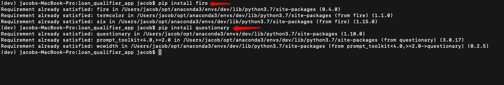
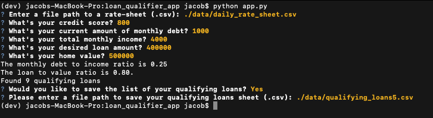

# Loan Qualifier Application

This application is designed to quickly retrieve a users loan qualification factors, compare those against a list of qualifying lenders, and return a list of qualified lenders based on their loan/credit factors. This will allow the user quickly narrow down the focus of their lender search when looking for a loan.

---

## Technologies
Code Base: **Python 3.7**  
Libraries/Packages Used:
**csv**, **sys**, **pathlib**, **fire**, **questionary**  
**Library Links:** [Pathlib](https://docs.python.org/3/library/pathlib.html), [Fire](https://github.com/google/python-fire), [Questionary](https://pypi.org/project/questionary/)

---

## Installation Guide

Before running this application, make sure you have the Fire & Questionary library installed.  
*Fire Install & Questionary Install in the Command Line*    



---

## Usage

Once you've downloaded the application, navigate to the directory where it is stored. Within Terminal or Git Bash, run the following code:  

```python
python app.py
```

You will be prompted to input the file path for your bank daily rate sheet, your credit score, your monthly debt payments, your monthly income, the value of the loan you're requesting, and the value of the asset you are planning on purchasing. Finally, you'll be asked if you would like to save the list of qualifying lenders to your computer.  

**Input Example**  


---

## Contributors

Jacob Vissering
UW Fintech Bootcamp

---

## License

MIT License

Copyright (c) [2021] [Jacob Vissering]

Permission is hereby granted, free of charge, to any person obtaining a copy
of this software and associated documentation files (the "Software"), to deal
in the Software without restriction, including without limitation the rights
to use, copy, modify, merge, publish, distribute, sublicense, and/or sell
copies of the Software, and to permit persons to whom the Software is
furnished to do so, subject to the following conditions:

The above copyright notice and this permission notice shall be included in all
copies or substantial portions of the Software.

THE SOFTWARE IS PROVIDED "AS IS", WITHOUT WARRANTY OF ANY KIND, EXPRESS OR
IMPLIED, INCLUDING BUT NOT LIMITED TO THE WARRANTIES OF MERCHANTABILITY,
FITNESS FOR A PARTICULAR PURPOSE AND NONINFRINGEMENT. IN NO EVENT SHALL THE
AUTHORS OR COPYRIGHT HOLDERS BE LIABLE FOR ANY CLAIM, DAMAGES OR OTHER
LIABILITY, WHETHER IN AN ACTION OF CONTRACT, TORT OR OTHERWISE, ARISING FROM,
OUT OF OR IN CONNECTION WITH THE SOFTWARE OR THE USE OR OTHER DEALINGS IN THE
SOFTWARE.
